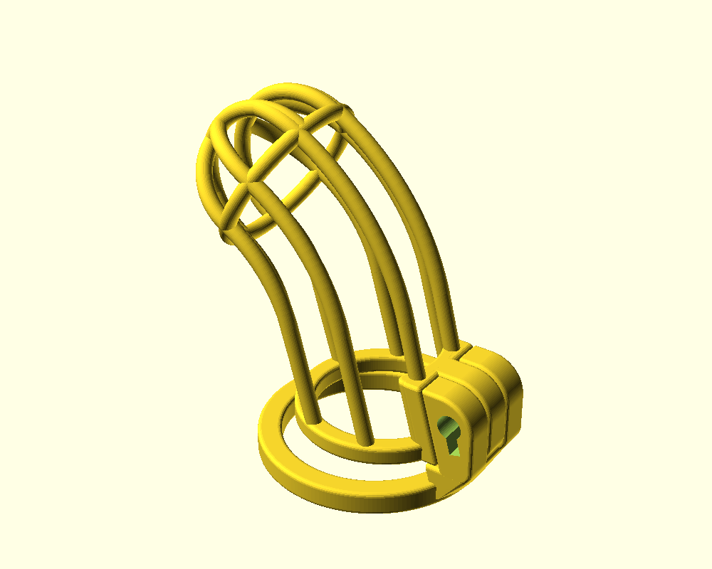
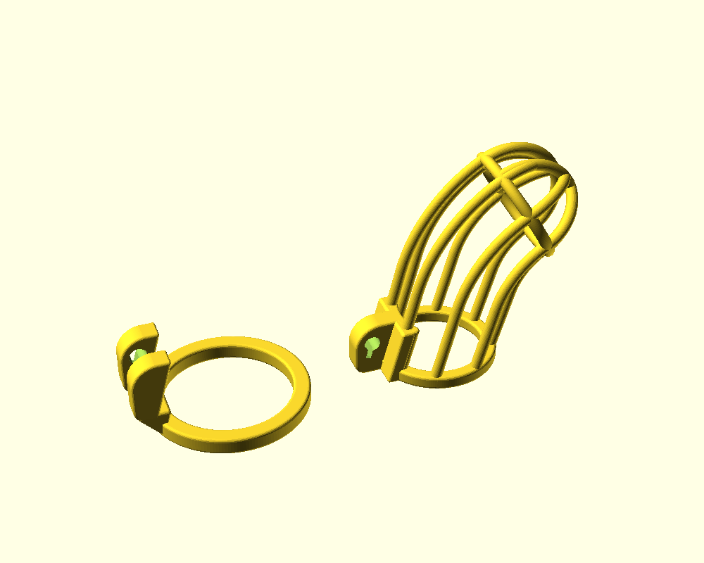
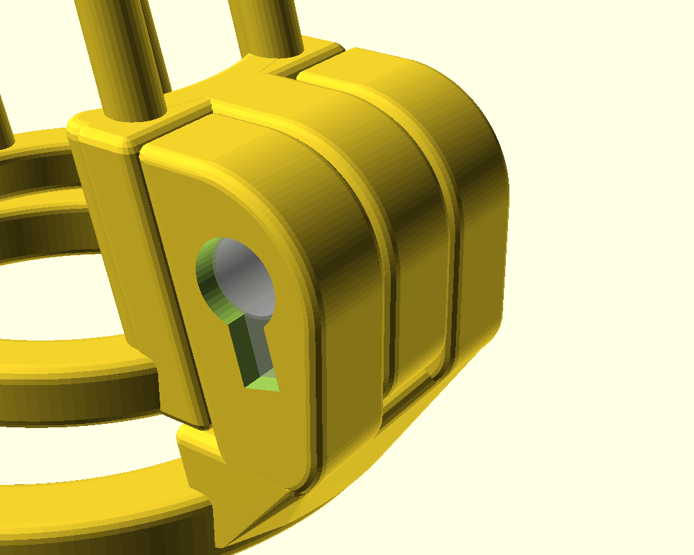
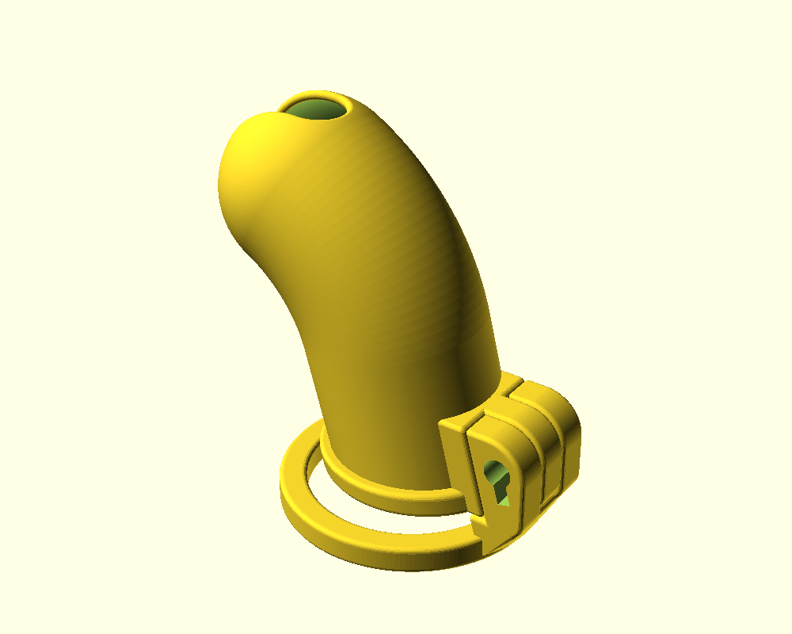
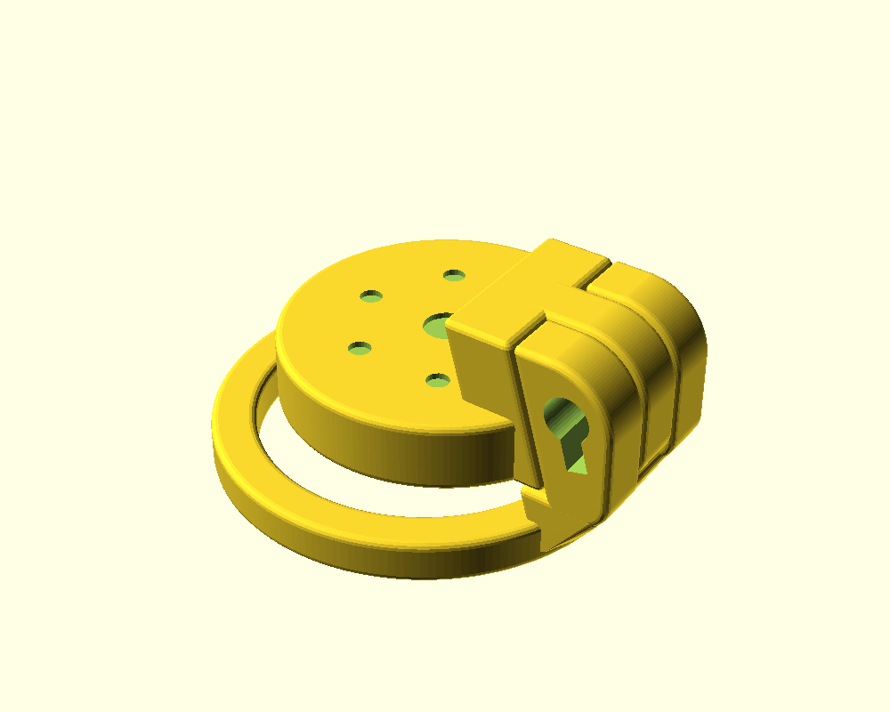
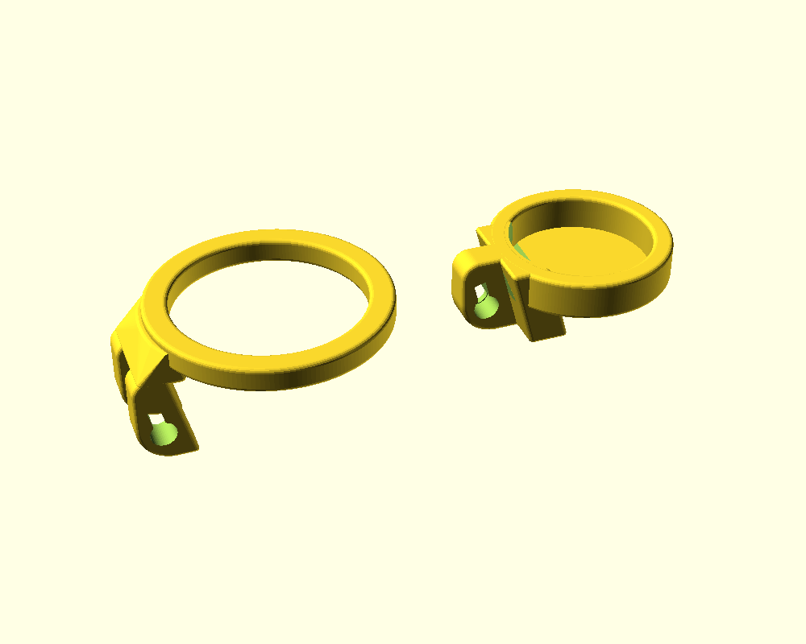

# (18+ NSFW) Parametric 3D-printable chastity cage in OpenSCAD
## Children, leave the room now!

 This work is licensed under a <a rel="license" href="http://creativecommons.org/licenses/by-sa/3.0/">Creative Commons Attribution-ShareAlike 3.0 Unported License</a>.

This is a major overhaul of [Dani119's parametric chastity cage](https://www.thingiverse.com/thing:2764421). The original author's notes:

> Changes from version 1: changed the opening at the tip from a hole to a slot, strengthened the area around the keyhole, changed the dovetail to a robust slot, added some options to improve printability, made it more customizable, and cleaned up the code a lot.
>
> Customize it to your own dimensions in OpenSCAD! This thing is fully parametric! Included in the repository are easy-to-print, easy-to-use measurement tools also if you need them.
>
> **I have now removed the non-commercial clause from the CC license**. It was present on the original cage that I remixed from; but now the code is so completely distinct that I feel I can properly claim it as my own and license it as I see fit.

## What's new in this fork

- **Custom lock.** The cage is built around a small cylinder lock modelled in Fusion 360 instead of the Holy-Trainer-style "stealth" lock.
- **Solid wall.** The bars can be replaced by a solid wall of the same shape.
- **Flat top.** You can build a flat cap instead of the barred cage: a wall ring closed by a plate with holes.
- **Printable base rings.** The base ring and the cage ring can have a square or rounded-square cross-section instead of a round one.
- **Bridge layer.** An optional thin layer under the flat plate lets the slicer bridge it cleanly.
- **Smoother curves.** Resolution uses `$fa`/`$fs`, so large rings are smooth and small parts stay light.
- **Customizer tabs.** Parameters are grouped into tabs and named in `snake_case`.

## Usage

1. Open `parametric cage.scad` in [OpenSCAD](https://openscad.org/). A recent development snapshot with the **Manifold** backend is recommended (Preferences → Advanced → Backend): a full render then takes about a second.
2. Open the Customizer (Window → Customizer) and set your dimensions. The measurement gauges in this repository (`parametric cage gauge - *.scad`) help with that.
3. Render (F6) and export the STL. Set `separate_parts = 1` to lay the cage and the base ring out side by side for printing.

Preview (F5) is deliberately coarser than the render to stay fast.

## Lock

The lock case is cut for a small cylinder lock (see `fusion_lock.scad` for all dimensions):

| Part | Shape |
|---|---|
| Shell | Ø6 mm cylinder, 12.8 mm long, with a 2.7 mm fin 7 mm below the axis |
| Core | Ø5.5 mm cylinder, sticking out 5.8 mm past the shell, with a 1.7 mm cam at the far end |

The key goes into the shell end. The lock slides in cam-first from the key side. Turning the key 45° clockwise swings the cam into a closed pocket in the base part, so the lock can't be pulled out. The pocket sits entirely inside one part, so the cam never crosses the sliding joint.

- `lock_margin` is the clearance around the whole lock, including the cam's pocket.
- `lock_key_depth` sets how far the key face sits below the case surface.
- `lock_clockwise` flips the turning direction. The default (clockwise) swings the cam toward the cage, where there is plenty of material. Turning the other way breaks through the outer wall of the case, so rework the case if your lock turns the other way.
- `show_lock` draws the lock in place (preview only), in the unlocked or locked position.

## Solid wall

With `solid_wall = 1`, the bars and the glans cap are replaced by a solid wall along the same path: the straight segment, the bend and a domed cap. The front slit (`slit_width`) is kept, with rounded ends and a rounded lip all around, like the bars. `slit_start` and `slit_end` set how far it runs, in degrees over the dome from its base on the lock side (90 = the tip, 180 = the base on the far side). The inner surface stays at `cage_diameter`, and the wall grows outward by `solid_wall_thickness`.

The cage ring and the lock block follow the wall: the ring leans with `tilt` and is flush with the inner surface, and the lock block runs straight into the wall with nothing sticking into the cavity.

## Flat top

With `flat_top = 1`, the barred cage is replaced by a flat cap. The cage ring grows upward into a wall (`flat_wall_height`) and is closed by a plate with a center hole and a circle of smaller holes. The lock block becomes a plain slab joined to the wall; the arc that wraps the cage ring isn't needed here.

Printed ring-down, the plate is one large bridge, and the holes would break it into pieces. With `flat_bridge_layer = 1` (the default), the holes stop a thin layer (`flat_bridge_layer_thickness`, 0.2 mm) short of the underside. The slicer then bridges the whole plate in one piece. Poke the layer through after printing.

Set `flat_bridge_layer_thickness` to your layer height, or to two layers if the bridge sags.

## Base rings

`base_ring_roundness` sets the cross-section of the flat base ring and of the cage ring, from 0 (square, easiest to print) to 1 (round, the original torus). The corner radius is `base_ring_roundness × base_ring_thickness / 2` on both rings. The default of 0.33 matches the 0.99 mm edge rounding of the lock block at the default 6 mm thickness.

The wavy base ring (`wavy_base = 1`) always stays round. It needs supports either way.

## Customizer parameters

| Tab | Parameters |
|---|---|
| General | `separate_parts`, `flat_top`, `cage_diameter`, `tilt`, `gap` |
| Cage | `penis_length`, `cage_bar_thickness`, `cage_bar_count`, `solid_wall`, `solid_wall_thickness`, `slit_width`, `slit_start`, `slit_end`, `bend_point_x`, `bend_point_z` |
| Flat top | `flat_wall_height`, `flat_plate_thickness`, `flat_center_hole`, `flat_hole_count`, `flat_hole_diameter`, `flat_hole_radius`, `flat_bridge_layer`, `flat_bridge_layer_thickness` |
| Base ring | `base_ring_diameter`, `base_ring_thickness`, `base_ring_roundness`, `wavy_base`, `wave_angle` |
| Lock | `lock_key_depth`, `lock_clockwise`, `show_lock` |
| Clearances | `lock_margin`, `part_margin` |

Saved parameter sets that use the old names (`wavyBase`, `waveAngle`, `separateParts`) need those keys renamed.

## Files

| File | Contents |
|---|---|
| `parametric cage.scad` | The cage and the base ring |
| `fusion_lock.scad` | Lock dimensions, the lock cavity and a preview model of the lock |
| `torus.scad` | Torus helpers, including rings with a rectangular cross-section |
| `handyfunctions.scad`, `vec3math.scad` | Transform shortcuts and vector math |
| `stealth_lock.scad` | The original stealth lock shape (no longer used) |
| `parametric cage gauge - *.scad` | Printable measurement gauges |

Feedback, suggestions, and remixes are more than welcome!
